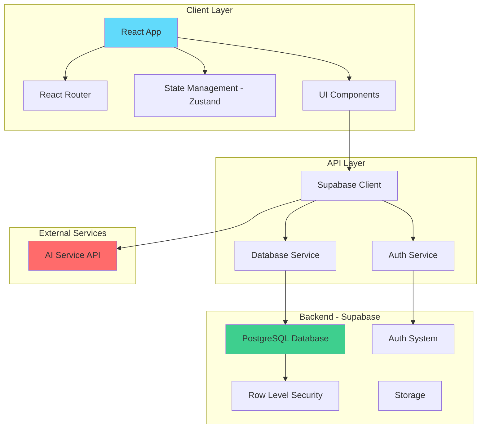

# Design Document

## Overview

The Online Learning System (LMS) is a full-stack web application built with React/TypeScript frontend and Supabase backend. The system supports three user roles (Student, Instructor, Admin) with role-based access control. The architecture follows a client-server model with real-time data synchronization through Supabase.

**Key Design Principles:**
- Component-based architecture for reusability
- Role-based access control (RBAC)
- Optimistic UI updates for better UX
- Mobile-first responsive design
- Real-time data synchronization

## Architecture

### System Architecture



### Frontend Architecture

**Technology Stack:**
- React 18 with TypeScript
- Vite for build tooling
- React Router v6 for routing
- Zustand for state management
- TailwindCSS for styling
- Supabase JS Client for backend communication

**Folder Structure:**
```
src/
├── components/          # Reusable UI components
│   ├── common/         # Shared components (Button, Input, Card)
│   ├── layout/         # Layout components (Header, Sidebar, Footer)
│   ├── student/        # Student-specific components
│   ├── instructor/     # Instructor-specific components
│   └── admin/          # Admin-specific components
├── pages/              # Page components
│   ├── auth/           # Login, Register
│   ├── student/        # Student pages
│   ├── instructor/     # Instructor pages
│   └── admin/          # Admin pages
├── hooks/              # Custom React hooks
├── services/           # API service layer
├── stores/             # Zustand stores
├── types/              # TypeScript type definitions
├── utils/              # Utility functions
└── App.tsx             # Root component
```

### Backend Architecture (Supabase)

**Database:** PostgreSQL with Row Level Security (RLS)
**Authentication:** Supabase Auth with email/password
**Storage:** Supabase Storage for file uploads (future enhancement)
**Real-time:** Supabase Realtime for live updates

## Components and Interfaces

### Core Components

#### 1. Authentication Components
- **LoginForm**: Email/password login with validation
- **RegisterForm**: User registration with role selection
- **ProtectedRoute**: Route guard based on authentication status
- **RoleGuard**: Route guard based on user role

#### 2. Student Components
- **StudentDashboard**: Overview of enrolled courses and progress
- **CourseCard**: Display course information
- **CourseCatalog**: Browse and search available courses
- **LessonViewer**: Display lesson content
- **AssignmentSubmission**: Submit assignment form
- **QuizTaker**: Interactive quiz interface
- **AIAssistant**: Chat interface for AI Q&A

#### 3. Instructor Components
- **InstructorDashboard**: Course management overview
- **CourseEditor**: Create/edit course details
- **LessonEditor**: Create/edit lesson content
- **AssignmentCreator**: Create assignment with deadline
- **QuizCreator**: Create quiz with questions
- **StudentProgressView**: View student progress and grades
- **GradingInterface**: Grade student submissions

#### 4. Admin Components
- **AdminDashboard**: System overview
- **UserManagement**: List and manage users
- **RoleEditor**: Change user roles

#### 5. Common Components
- **Button**: Reusable button with variants
- **Input**: Form input with validation
- **Card**: Container component
- **Modal**: Dialog component
- **Loader**: Loading spinner
- **ErrorBoundary**: Error handling wrapper

### Service Layer Interfaces

```typescript
// Auth Service
interface AuthService {
  login(email: string, password: string): Promise<User>
  register(email: string, password: string, name: string): Promise<User>
  logout(): Promise<void>
  getCurrentUser(): Promise<User | null>
  updateProfile(userId: string, data: Partial<User>): Promise<User>
}

// Course Service
interface CourseService {
  getCourses(): Promise<Course[]>
  getCourseById(id: string): Promise<Course>
  createCourse(data: CreateCourseInput): Promise<Course>
  updateCourse(id: string, data: UpdateCourseInput): Promise<Course>
  deleteCourse(id: string): Promise<void>
  enrollStudent(courseId: string, studentId: string): Promise<Enrollment>
  unenrollStudent(courseId: string, studentId: string): Promise<void>
}

// Lesson Service
interface LessonService {
  getLessonsByCourse(courseId: string): Promise<Lesson[]>
  getLessonById(id: string): Promise<Lesson>
  createLesson(data: CreateLessonInput): Promise<Lesson>
  updateLesson(id: string, data: UpdateLessonInput): Promise<Lesson>
  deleteLesson(id: string): Promise<void>
  markLessonComplete(lessonId: string, studentId: string): Promise<void>
}

// Assignment Service
interface AssignmentService {
  getAssignmentsByCourse(courseId: string): Promise<Assignment[]>
  createAssignment(data: CreateAssignmentInput): Promise<Assignment>
  submitAssignment(data: SubmitAssignmentInput): Promise<Submission>
  gradeSubmission(submissionId: string, grade: number, feedback: string): Promise<Submission>
  getStudentSubmissions(studentId: string): Promise<Submission[]>
}

// Quiz Service
interface QuizService {
  getQuizzesByCourse(courseId: string): Promise<Quiz[]>
  createQuiz(data: CreateQuizInput): Promise<Quiz>
  submitQuizAnswers(quizId: string, answers: QuizAnswer[]): Promise<QuizResult>
  getQuizResults(studentId: string): Promise<QuizResult[]>
}

// Progress Service
interface ProgressService {
  getStudentProgress(studentId: string, courseId: string): Promise<Progress>
  updateProgress(studentId: string, courseId: string): Promise<Progress>
  getCourseStatistics(courseId: string): Promise<CourseStatistics>
}

// AI Service
interface AIService {
  sendMessage(message: string, context: CourseContext): Promise<string>
  getChatHistory(sessionId: string): Promise<ChatMessage[]>
}

// User Service
interface UserService {
  getUsers(): Promise<User[]>
  getUserById(id: string): Promise<User>
  updateUserRole(userId: string, role: UserRole): Promise<User>
  deactivateUser(userId: string): Promise<void>
}
```

## Data Models

### Database Schema

```sql
-- Users table (extends Supabase auth.users)
CREATE TABLE profiles (
  id UUID PRIMARY KEY REFERENCES auth.users(id),
  email TEXT UNIQUE NOT NULL,
  full_name TEXT NOT NULL,
  role TEXT NOT NULL CHECK (role IN ('student', 'instructor', 'admin')),
  avatar_url TEXT,
  is_active BOOLEAN DEFAULT true,
  created_at TIMESTAMP WITH TIME ZONE DEFAULT NOW(),
  updated_at TIMESTAMP WITH TIME ZONE DEFAULT NOW()
);

-- Courses table
CREATE TABLE courses (
  id UUID PRIMARY KEY DEFAULT uuid_generate_v4(),
  title TEXT NOT NULL,
  description TEXT,
  category TEXT,
  instructor_id UUID REFERENCES profiles(id) NOT NULL,
  is_published BOOLEAN DEFAULT false,
  created_at TIMESTAMP WITH TIME ZONE DEFAULT NOW(),
  updated_at TIMESTAMP WITH TIME ZONE DEFAULT NOW()
);

-- Lessons table
CREATE TABLE lessons (
  id UUID PRIMARY KEY DEFAULT uuid_generate_v4(),
  course_id UUID REFERENCES courses(id) ON DELETE CASCADE NOT NULL,
  title TEXT NOT NULL,
  content TEXT NOT NULL,
  content_type TEXT DEFAULT 'text' CHECK (content_type IN ('text', 'video', 'document')),
  order_index INTEGER NOT NULL,
  created_at TIMESTAMP WITH TIME ZONE DEFAULT NOW(),
  updated_at TIMESTAMP WITH TIME ZONE DEFAULT NOW()
);

-- Enrollments table
CREATE TABLE enrollments (
  id UUID PRIMARY KEY DEFAULT uuid_generate_v4(),
  student_id UUID REFERENCES profiles(id) NOT NULL,
  course_id UUID REFERENCES courses(id) ON DELETE CASCADE NOT NULL,
  enrolled_at TIMESTAMP WITH TIME ZONE DEFAULT NOW(),
  UNIQUE(student_id, course_id)
);

-- Lesson completions table
CREATE TABLE lesson_completions (
  id UUID PRIMARY KEY DEFAULT uuid_generate_v4(),
  student_id UUID REFERENCES profiles(id) NOT NULL,
  lesson_id UUID REFERENCES lessons(id) ON DELETE CASCADE NOT NULL,
  completed_at TIMESTAMP WITH TIME ZONE DEFAULT NOW(),
  UNIQUE(student_id, lesson_id)
);

-- Assignments table
CREATE TABLE assignments (
  id UUID PRIMARY KEY DEFAULT uuid_generate_v4(),
  course_id UUID REFERENCES courses(id) ON DELETE CASCADE NOT NULL,
  title TEXT NOT NULL,
  description TEXT,
  max_points INTEGER DEFAULT 100,
  deadline TIMESTAMP WITH TIME ZONE,
  created_at TIMESTAMP WITH TIME ZONE DEFAULT NOW(),
  updated_at TIMESTAMP WITH TIME ZONE DEFAULT NOW()
);

-- Submissions table
CREATE TABLE submissions (
  id UUID PRIMARY KEY DEFAULT uuid_generate_v4(),
  assignment_id UUID REFERENCES assignments(id) ON DELETE CASCADE NOT NULL,
  student_id UUID REFERENCES profiles(id) NOT NULL,
  content TEXT NOT NULL,
  submitted_at TIMESTAMP WITH TIME ZONE DEFAULT NOW(),
  grade INTEGER,
  feedback TEXT,
  graded_at TIMESTAMP WITH TIME ZONE,
  is_late BOOLEAN DEFAULT false,
  UNIQUE(assignment_id, student_id)
);

-- Quizzes table
CREATE TABLE quizzes (
  id UUID PRIMARY KEY DEFAULT uuid_generate_v4(),
  course_id UUID REFERENCES courses(id) ON DELETE CASCADE NOT NULL,
  title TEXT NOT NULL,
  description TEXT,
  time_limit_minutes INTEGER,
  max_attempts INTEGER DEFAULT 1,
  created_at TIMESTAMP WITH TIME ZONE DEFAULT NOW(),
  updated_at TIMESTAMP WITH TIME ZONE DEFAULT NOW()
);

-- Quiz questions table
CREATE TABLE quiz_questions (
  id UUID PRIMARY KEY DEFAULT uuid_generate_v4(),
  quiz_id UUID REFERENCES quizzes(id) ON DELETE CASCADE NOT NULL,
  question_text TEXT NOT NULL,
  options JSONB NOT NULL, -- Array of options
  correct_answer INTEGER NOT NULL, -- Index of correct option
  explanation TEXT,
  order_index INTEGER NOT NULL
);

-- Quiz attempts table
CREATE TABLE quiz_attempts (
  id UUID PRIMARY KEY DEFAULT uuid_generate_v4(),
  quiz_id UUID REFERENCES quizzes(id) ON DELETE CASCADE NOT NULL,
  student_id UUID REFERENCES profiles(id) NOT NULL,
  answers JSONB NOT NULL, -- Array of student answers
  score INTEGER NOT NULL,
  total_questions INTEGER NOT NULL,
  started_at TIMESTAMP WITH TIME ZONE DEFAULT NOW(),
  submitted_at TIMESTAMP WITH TIME ZONE DEFAULT NOW()
);

-- AI chat sessions table
CREATE TABLE ai_chat_sessions (
  id UUID PRIMARY KEY DEFAULT uuid_generate_v4(),
  student_id UUID REFERENCES profiles(id) NOT NULL,
  course_id UUID REFERENCES courses(id) ON DELETE CASCADE,
  messages JSONB NOT NULL DEFAULT '[]', -- Array of messages
  created_at TIMESTAMP WITH TIME ZONE DEFAULT NOW(),
  updated_at TIMESTAMP WITH TIME ZONE DEFAULT NOW()
);
```

### TypeScript Type Definitions

```typescript
// User types
type UserRole = 'student' | 'instructor' | 'admin'

interface User {
  id: string
  email: string
  full_name: string
  role: UserRole
  avatar_url?: string
  is_active: boolean
  created_at: string
  updated_at: string
}

// Course types
interface Course {
  id: string
  title: string
  description: string
  category: string
  instructor_id: string
  instructor?: User
  is_published: boolean
  created_at: string
  updated_at: string
  lesson_count?: number
  enrolled_count?: number
}

interface CreateCourseInput {
  title: string
  description: string
  category: string
}

interface UpdateCourseInput {
  title?: string
  description?: string
  category?: string
  is_published?: boolean
}

// Lesson types
interface Lesson {
  id: string
  course_id: string
  title: string
  content: string
  content_type: 'text' | 'video' | 'document'
  order_index: number
  created_at: string
  updated_at: string
  is_completed?: boolean // For student view
}

interface CreateLessonInput {
  course_id: string
  title: string
  content: string
  content_type: 'text' | 'video' | 'document'
  order_index: number
}

// Enrollment types
interface Enrollment {
  id: string
  student_id: string
  course_id: string
  enrolled_at: string
  course?: Course
}

// Assignment types
interface Assignment {
  id: string
  course_id: string
  title: string
  description: string
  max_points: number
  deadline: string
  created_at: string
  updated_at: string
}

interface Submission {
  id: string
  assignment_id: string
  student_id: string
  content: string
  submitted_at: string
  grade?: number
  feedback?: string
  graded_at?: string
  is_late: boolean
  assignment?: Assignment
  student?: User
}

interface SubmitAssignmentInput {
  assignment_id: string
  content: string
}

// Quiz types
interface Quiz {
  id: string
  course_id: string
  title: string
  description: string
  time_limit_minutes?: number
  max_attempts: number
  created_at: string
  updated_at: string
}

interface QuizQuestion {
  id: string
  quiz_id: string
  question_text: string
  options: string[]
  correct_answer: number
  explanation: string
  order_index: number
}

interface QuizAnswer {
  question_id: string
  selected_answer: number
}

interface QuizAttempt {
  id: string
  quiz_id: string
  student_id: string
  answers: QuizAnswer[]
  score: number
  total_questions: number
  started_at: string
  submitted_at: string
}

interface QuizResult {
  attempt: QuizAttempt
  questions: QuizQuestion[]
  passed: boolean
}

// Progress types
interface Progress {
  student_id: string
  course_id: string
  completed_lessons: number
  total_lessons: number
  completion_percentage: number
  average_quiz_score?: number
  average_assignment_grade?: number
}

interface CourseStatistics {
  course_id: string
  total_students: number
  average_progress: number
  average_quiz_score: number
  average_assignment_grade: number
}

// AI Chat types
interface ChatMessage {
  role: 'user' | 'assistant'
  content: string
  timestamp: string
}

interface AIChatSession {
  id: string
  student_id: string
  course_id?: string
  messages: ChatMessage[]
  created_at: string
  updated_at: string
}

interface CourseContext {
  course_id?: string
  lesson_id?: string
  course_title?: string
  lesson_content?: string
}
```


## Correctness Properties

A property is a characteristic or behavior that should hold true across all valid executions of a system—essentially, a formal statement about what the system should do. Properties serve as the bridge between human-readable specifications and machine-verifiable correctness guarantees.

### Property Reflection

After analyzing all acceptance criteria, I identified several areas where properties can be consolidated:

**Consolidations:**
- Display properties (2.1, 2.4, 2.5, 3.1, 3.5, 4.1, 4.4, 5.1, 10.1, 10.3, 11.1) can be grouped into "Data Display Completeness" properties
- Navigation properties (2.3, 4.2) can be combined into "Navigation Behavior"
- CRUD operations (8.1, 8.2, 9.1, 9.2) follow similar patterns and can use shared property patterns
- Progress calculation (2.2, 10.2) uses same underlying logic
- Search/filter operations (3.2, 11.4) follow same pattern

**Redundancies Eliminated:**
- Properties about "displaying" data are often subsumed by properties about "retrieving and rendering" data correctly
- Multiple properties about "saving" can be consolidated into persistence properties
- UI state properties can be combined where they test the same underlying state management

### Core Properties

#### Property 1: Authentication Role-Based Redirection
*For any* valid user credentials with a specific role (student, instructor, admin), authenticating with those credentials should redirect to the dashboard corresponding to that role.
**Validates: Requirements 1.2**

#### Property 2: Invalid Credentials Rejection
*For any* invalid credentials (wrong password, non-existent email, malformed input), authentication attempts should fail and display an error message without navigation.
**Validates: Requirements 1.3**

#### Property 3: Default Role Assignment
*For any* new user registration with valid data, the created user account should have the role set to 'student' by default.
**Validates: Requirements 1.4**

#### Property 4: Logout Session Termination
*For any* authenticated user, performing logout should clear the session and prevent access to protected routes.
**Validates: Requirements 1.5**

#### Property 5: Protected Route Access Control
*For any* unauthenticated user and any protected route, attempting to access that route should redirect to the login page.
**Validates: Requirements 1.6**

#### Property 6: Progress Calculation Accuracy
*For any* student enrolled in a course with N total lessons and M completed lessons, the displayed progress percentage should equal (M/N) * 100.
**Validates: Requirements 2.2, 10.2**

#### Property 7: Course Search Filtering
*For any* search query and course catalog, the filtered results should only include courses where the query matches the course title or category (case-insensitive).
**Validates: Requirements 3.2, 11.4**

#### Property 8: Enrollment State Consistency
*For any* student and course, if the student is enrolled in the course, the enrollment button should display "Already Enrolled" status; otherwise, it should display "Enroll".
**Validates: Requirements 3.4**

#### Property 9: Lesson Ordering Preservation
*For any* course with lessons, the displayed lesson list should be ordered by the order_index field in ascending order.
**Validates: Requirements 4.1**

#### Property 10: Lesson Completion Tracking
*For any* student and lesson, marking the lesson as completed should persist the completion status and reflect in subsequent views.
**Validates: Requirements 4.3, 4.4**

#### Property 11: Non-Linear Lesson Access
*For any* student enrolled in a course, the student should be able to access any lesson in the course regardless of completion status of other lessons.
**Validates: Requirements 4.5**

#### Property 12: Late Submission Detection
*For any* assignment submission, if the submission timestamp is after the assignment deadline, the submission should be marked with is_late = true.
**Validates: Requirements 5.3**

#### Property 13: Quiz Score Calculation
*For any* quiz attempt with N questions and M correct answers, the calculated score should equal (M/N) * 100.
**Validates: Requirements 6.2**

#### Property 14: Quiz Result Persistence
*For any* completed quiz attempt, storing the results and then retrieving them should return the same answers, score, and question data.
**Validates: Requirements 6.3**

#### Property 15: Chat History Persistence
*For any* AI chat session, adding messages to the session and then retrieving the session should return all messages in chronological order.
**Validates: Requirements 7.3**

#### Property 16: Course Data Persistence
*For any* course creation or update operation, the data saved to the database should match the input data when retrieved.
**Validates: Requirements 8.1, 8.3, 13.1**

#### Property 17: Lesson Deletion Reordering
*For any* course with N lessons, deleting lesson at index I should result in N-1 lessons with order_index values from 0 to N-2 (no gaps).
**Validates: Requirements 8.4**

#### Property 18: Course Publish State Toggle
*For any* course, toggling the is_published field should persist the new state and affect course visibility in the catalog.
**Validates: Requirements 8.5**

#### Property 19: Assignment Data Completeness
*For any* created assignment, the stored assignment should contain all required fields: title, description, deadline, max_points, and course_id.
**Validates: Requirements 9.1**

#### Property 20: Quiz Question Data Integrity
*For any* created quiz with questions, each question should have: question_text, options array, correct_answer index, and the correct_answer should be a valid index within the options array.
**Validates: Requirements 9.2**

#### Property 21: Role Change Permission Update
*For any* user, changing the user's role should immediately affect which routes and actions the user can access.
**Validates: Requirements 11.2**

#### Property 22: User Deactivation Access Restriction
*For any* user, setting is_active to false should prevent that user from successfully authenticating.
**Validates: Requirements 11.3**

#### Property 23: Data Persistence Round-Trip
*For any* data entity (course, lesson, assignment, quiz, submission), creating the entity and then retrieving it by ID should return an equivalent entity with all fields preserved.
**Validates: Requirements 13.1, 13.2**

#### Property 24: Optimistic Update Consistency
*For any* user action that modifies data, the UI should update immediately (optimistically) and should match the server state after the server confirms the change.
**Validates: Requirements 13.4**

### Edge Cases and Examples

#### Example 1: Login Page Rendering
Verify that the login page contains email input, password input, and submit button elements.
**Validates: Requirements 1.1**

#### Example 2: AI Assistant Interface
Verify that opening the AI assistant displays a chat interface with message input and message history container.
**Validates: Requirements 7.1**

#### Example 3: AI Service Error Handling
When the AI service returns an error or is unavailable, verify that a user-friendly error message is displayed instead of crashing.
**Validates: Requirements 7.5**

#### Example 4: Database Error Handling
When a database operation fails, verify that the application displays a user-friendly error message and does not crash.
**Validates: Requirements 13.3**

#### Edge Case 1: Quiz Timer Auto-Submit
For quizzes with time limits, verify that the quiz auto-submits when the timer reaches zero.
**Validates: Requirements 6.4**


## Error Handling

### Error Categories

1. **Authentication Errors**
   - Invalid credentials
   - Expired sessions
   - Insufficient permissions
   - Account deactivated

2. **Validation Errors**
   - Missing required fields
   - Invalid data formats
   - Constraint violations (e.g., duplicate enrollment)

3. **Network Errors**
   - Connection timeout
   - Server unavailable
   - Request failed

4. **Database Errors**
   - Query failures
   - Constraint violations
   - Connection issues

5. **External Service Errors**
   - AI service unavailable
   - API rate limits exceeded

### Error Handling Strategy

**Client-Side:**
- Display user-friendly error messages
- Provide actionable feedback (e.g., "Please check your email format")
- Implement retry mechanisms for transient failures
- Log errors for debugging (without exposing sensitive data)
- Use error boundaries to prevent app crashes

**Server-Side (Supabase):**
- Use Row Level Security (RLS) policies for authorization
- Implement database constraints for data integrity
- Return structured error responses
- Log errors for monitoring

**Error Response Format:**
```typescript
interface ErrorResponse {
  error: {
    code: string
    message: string
    details?: any
  }
}
```

### Specific Error Scenarios

1. **Login Failure**: Display "Invalid email or password" without revealing which is incorrect
2. **Enrollment Conflict**: Display "You are already enrolled in this course"
3. **Permission Denied**: Display "You don't have permission to perform this action"
4. **Network Timeout**: Display "Connection timeout. Please try again"
5. **AI Service Down**: Display "AI assistant is temporarily unavailable. Please try again later"
6. **File Upload Failure**: Display "Failed to upload file. Please check file size and format"

## Testing Strategy

### Dual Testing Approach

The LMS will use both unit tests and property-based tests for comprehensive coverage:

**Unit Tests:**
- Test specific examples and edge cases
- Test error conditions and boundary values
- Test component rendering and user interactions
- Test integration between services
- Focus on concrete scenarios

**Property-Based Tests:**
- Test universal properties across all inputs
- Generate random test data for comprehensive coverage
- Verify correctness properties hold for all valid inputs
- Minimum 100 iterations per property test
- Focus on business logic and data transformations

### Testing Tools

**Frontend Testing:**
- **Vitest**: Unit test runner
- **React Testing Library**: Component testing
- **fast-check**: Property-based testing library for TypeScript
- **MSW (Mock Service Worker)**: API mocking

**Backend Testing:**
- **Supabase Local Development**: Test against local Supabase instance
- **Database Migrations**: Test schema changes
- **RLS Policy Testing**: Verify security policies

### Test Organization

```
src/
├── components/
│   ├── Button.tsx
│   ├── Button.test.tsx          # Unit tests
│   └── Button.properties.test.tsx # Property tests
├── services/
│   ├── authService.ts
│   ├── authService.test.ts
│   └── authService.properties.test.ts
└── utils/
    ├── calculations.ts
    ├── calculations.test.ts
    └── calculations.properties.test.ts
```

### Property Test Configuration

Each property test must:
- Run minimum 100 iterations
- Reference the design document property number
- Use descriptive test names
- Tag format: `Feature: online-learning-system, Property {number}: {property_text}`

**Example Property Test:**
```typescript
import fc from 'fast-check'
import { describe, it, expect } from 'vitest'
import { calculateProgress } from './progressService'

describe('Progress Calculation', () => {
  it('Feature: online-learning-system, Property 6: Progress Calculation Accuracy', () => {
    fc.assert(
      fc.property(
        fc.integer({ min: 0, max: 100 }), // total lessons
        fc.integer({ min: 0, max: 100 }), // completed lessons
        (total, completed) => {
          fc.pre(completed <= total) // Precondition
          const progress = calculateProgress(completed, total)
          const expected = total === 0 ? 0 : (completed / total) * 100
          expect(progress).toBe(expected)
        }
      ),
      { numRuns: 100 }
    )
  })
})
```

### Test Coverage Goals

- **Unit Test Coverage**: Minimum 70% code coverage
- **Property Test Coverage**: All business logic functions
- **Integration Test Coverage**: All critical user flows
- **E2E Test Coverage**: Core user journeys (login, enroll, submit assignment, take quiz)

### Continuous Testing

- Run unit tests on every commit
- Run property tests before merging to main
- Run E2E tests on staging environment
- Monitor test performance and flakiness

## Implementation Notes

### Phase 1: Foundation (MVP)
- User authentication (login, register, logout)
- Basic student dashboard
- Course catalog and enrollment
- Simple lesson viewing
- Basic instructor course creation

### Phase 2: Core Features
- Assignment submission and grading
- Quiz creation and taking
- Progress tracking
- Student progress view for instructors

### Phase 3: Advanced Features
- AI Q&A assistant
- Admin user management
- Advanced analytics
- Real-time notifications

### Phase 4: Polish
- Responsive design refinements
- Performance optimization
- Accessibility improvements
- User experience enhancements

### Deployment Strategy

**Frontend (Netlify):**
- Connect GitHub repository
- Auto-deploy on push to main branch
- Environment variables for Supabase config
- Custom domain (optional)

**Backend (Supabase):**
- Use Supabase free tier
- Set up database schema
- Configure Row Level Security policies
- Enable Realtime for live updates
- Set up authentication providers

### Security Considerations

1. **Authentication**: Use Supabase Auth with secure password hashing
2. **Authorization**: Implement Row Level Security (RLS) policies
3. **Input Validation**: Validate all user inputs on client and server
4. **XSS Prevention**: Sanitize user-generated content
5. **CSRF Protection**: Use Supabase's built-in CSRF protection
6. **API Keys**: Store API keys in environment variables, never in code
7. **Rate Limiting**: Implement rate limiting for API calls (especially AI service)

### Performance Optimization

1. **Code Splitting**: Lazy load routes and components
2. **Caching**: Cache course data and user profiles
3. **Optimistic Updates**: Update UI immediately, sync with server in background
4. **Pagination**: Paginate large lists (courses, students, submissions)
5. **Image Optimization**: Compress and lazy load images
6. **Bundle Size**: Monitor and minimize bundle size
7. **Database Indexing**: Add indexes on frequently queried columns

### Accessibility

1. **Semantic HTML**: Use proper HTML elements
2. **ARIA Labels**: Add ARIA labels for screen readers
3. **Keyboard Navigation**: Ensure all features accessible via keyboard
4. **Color Contrast**: Meet WCAG AA standards
5. **Focus Management**: Manage focus for modals and dynamic content
6. **Alt Text**: Provide alt text for images

### Future Enhancements

1. **File Uploads**: Support file attachments for assignments
2. **Video Hosting**: Integrate video hosting for lessons
3. **Discussion Forums**: Add course discussion boards
4. **Certificates**: Generate completion certificates
5. **Gamification**: Add badges and achievements
6. **Mobile App**: Native mobile applications
7. **Offline Mode**: Support offline learning
8. **Advanced Analytics**: Detailed learning analytics dashboard
9. **Integration**: LTI integration with other LMS platforms
10. **Internationalization**: Multi-language support
